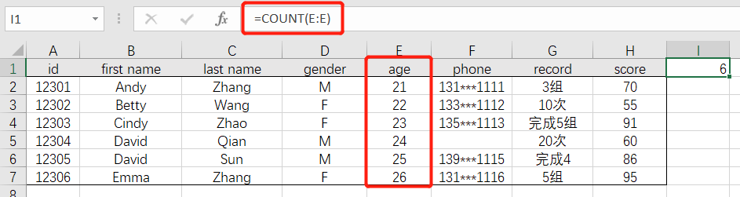

# 03-常见数值处理

 

## 计数操作

- 计算**数值型**数据的个数：`=COUNT(数据区域)`

 

- 计算**非空数值**的个数：`=COUNTA(数据区域)`

 

- 计算**空值**的个数：`=COUNTBLANK(数据区域)`

COUNTIF

COUNTIFS

## 学会几个常用函数公式，效率提高4.7%  Excel之家ExcelHome
https://mp.weixin.qq.com/s?__biz=MjM5NTcxODg0MA==&mid=2689810027&idx=1&sn=aedfa3d85bec125d3a1dc0700cd1574b&chksm=8353adbcb42424aae37fce4aa640ae17cfbdbc086b28a95916624570ea6203a2303666093013&mpshare=1&srcid=&sharer_sharetime=1587642171264&sharer_shareid=f44dfb8d1ce5101576067f9cd135d493&from=singlemessage&scene=1&subscene=10000&clicktime=1587779614&enterid=1587779614&ascene=1&devicetype=android-27&version=27000d39&nettype=WIFI&abtest_cookie=AAACAA%3D%3D&lang=zh_CN&exportkey=Acoh98LKA87hP9sY%2FPlYu9Y%3D&pass_ticket=tjBq1Fc%2BRjJplU%2BGswpQovR2Kc9qvdzF3U5%2F0la6T1TPlCV4WnsGrasjeclHP0cf&wx_header=1

## 函数Frequency，区间频率统计好帮手，数值文本全搞定

https://mp.weixin.qq.com/s?__biz=MzI0MjgyMTEyMQ==&mid=2247490951&idx=1&sn=f851aa31bdcb1e038ad7215f9670a519&chksm=e9772ce9de00a5ffcbbed87781970f8bb86b7adbc70436c4fc956c77d0994d412dd05da91446&mpshare=1&srcid=&sharer_sharetime=1588170288486&sharer_shareid=f44dfb8d1ce5101576067f9cd135d493&from=singlemessage&scene=1&subscene=10000&clicktime=1588246180&enterid=1588246180&ascene=1&devicetype=android-27&version=27000d63&nettype=WIFI&abtest_cookie=AAACAA%3D%3D&lang=zh_CN&exportkey=AY40K4WTWQDLdUtTXwNuCPg%3D&pass_ticket=Ht1yMWTIcTuKLxInE32LzpLhbCPrubq0Qf5Lu1N59j4iEDqEdqJbeqhypMy3wo0i&wx_header=1

## 进阶高手必备的10个Excel基础函数应用技巧解读

https://mp.weixin.qq.com/s?__biz=MzI0MjgyMTEyMQ==&mid=2247490994&idx=1&sn=045d9a2f1dd69d5bd94e3a1a6233eda1&chksm=e9772cdcde00a5ca3b59735b43b93d73f62b79e00a98de07df233a83bc63c7266f58064364a3&mpshare=1&srcid=&sharer_sharetime=1588859529101&sharer_shareid=f44dfb8d1ce5101576067f9cd135d493&from=singlemessage&scene=1&subscene=10000&clicktime=1588897254&enterid=1588897254&ascene=1&devicetype=android-27&version=27000e37&nettype=WIFI&abtest_cookie=AAACAA%3D%3D&lang=zh_CN&exportkey=Aa8BpxgONLVC0CpZJFzw8gk%3D&pass_ticket=joMSngo2Po2tfmCw73WsdZAhRvtmSChcQeJa0jLpa6Fanp9DJObmXnxjcZSO8oVC&wx_header=1

 

------

## 求和操作

SUM

SUMIF

SUMIFS

SUMPRODUCT

计算区域内不同单元格个数=SUMPRODUCT(1/COUNTIF(G2:M2,G2:M2))

 

------

## 统计值计算

MIN

MINIFS

MAX

MSAXIFS

AVERAGE

AVERAGEIF

MEDIAN

RANK

FREQUENCY

按组计算中位数（https://www.extendoffice.com/zh-CN/documents/excel/4815-excel-pivot-table-median.html）=MEDIAN(IF($B$2:$B$31=B2,$C$2:$C$31))

