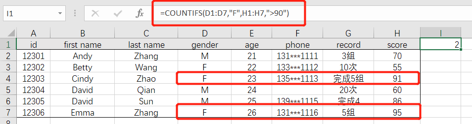
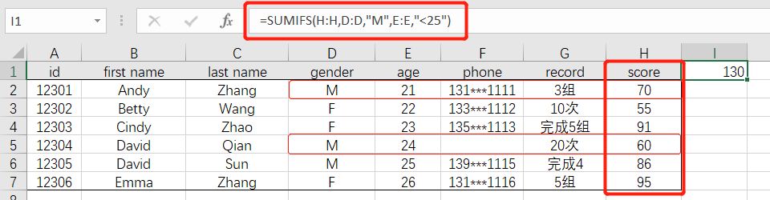

# 03-常见数值统计

 

## 统计个数

- 计算**数值型**数据的个数：`=COUNT(数据区域)`

 

- 计算**非空数值**的个数：`=COUNTA(数据区域)` 或 `=COUNTIF(数据区域,"<>")`

 

- 计算**空值**的个数：`=COUNTBLANK(数据区域)` 或 `=COUNTIF(数据区域,"=")`

 

- 根据条件统计个数：`=COUNTIF(数据区域,">数值")`  或 `=COUNTIF(数据区域,">"&单元格)`

 

- 根据**多个条件**计算个数：`=COUNTIFS(区域1,条件1,区域2,条件2,……)`

 

- 统计以某个字母（不区分大小写）开头的个数：`=COUNTIF(数据区域,"字母*")`

 

------

## 求和计算

> SUM函数的语法同样适用于其他统计函数，如：
>
>   MIN()、MINIF()、MINIFS()
>
>   MAX()、MAXIF()、MAXIFS()
>
>   MEDIAN()、AVERAGE()、AVERAGEIF()、AVERAGEIFS()……

 

- 简单求和：`=SUM(求和区域)`

 

- 根据条件求和：`=SUMIF(条件区域,条件,求和区域)`

 

- 根据多个条件求和：`=SUMIF(求和区域,条件区域1,条件1,条件区域2,条件2,…)`

 

- 

 

------

## 统计值计算

RANK

FREQUENCY

按组计算中位数（https://www.extendoffice.com/zh-CN/documents/excel/4815-excel-pivot-table-median.html）=MEDIAN(IF($B$2:$B$31=B2,$C$2:$C$31))

## 函数Frequency，区间频率统计好帮手，数值文本全搞定

https://mp.weixin.qq.com/s?__biz=MzI0MjgyMTEyMQ==&mid=2247490951&idx=1&sn=f851aa31bdcb1e038ad7215f9670a519&chksm=e9772ce9de00a5ffcbbed87781970f8bb86b7adbc70436c4fc956c77d0994d412dd05da91446&mpshare=1&srcid=&sharer_sharetime=1588170288486&sharer_shareid=f44dfb8d1ce5101576067f9cd135d493&from=singlemessage&scene=1&subscene=10000&clicktime=1588246180&enterid=1588246180&ascene=1&devicetype=android-27&version=27000d63&nettype=WIFI&abtest_cookie=AAACAA%3D%3D&lang=zh_CN&exportkey=AY40K4WTWQDLdUtTXwNuCPg%3D&pass_ticket=Ht1yMWTIcTuKLxInE32LzpLhbCPrubq0Qf5Lu1N59j4iEDqEdqJbeqhypMy3wo0i&wx_header=1

