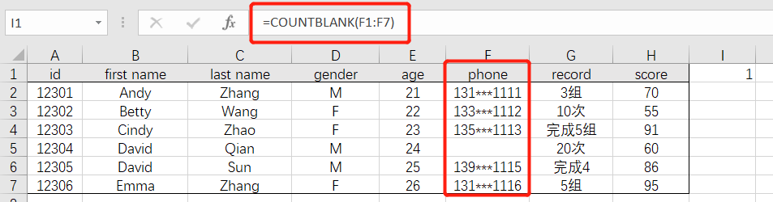

# 03-常见数值统计

- [统计个数](#统计个数)  COUNT()、COUNTA()、COUNTIF()、COUNTIFS()、COUNTBLANK()
- [求和计算](#求和计算)  SUM()、SUMIF()、SUMIFS() ...
- [排序与频率](#排序与频率)  RANK()、FREQUENCY()

 

## 统计个数

- 计算**数值型**数据的个数：`=COUNT(数据区域)`

 

- 计算**非空数值**的个数：`=COUNTA(数据区域)` 或 `=COUNTIF(数据区域,"<>")`

 

- 计算**空值**的个数：`=COUNTBLANK(数据区域)` 或 `=COUNTIF(数据区域,"=")`

 

- 根据条件统计个数：`=COUNTIF(数据区域,">数值")`  或 `=COUNTIF(数据区域,">"&单元格)`

 

- 根据**多个条件**计算个数：`=COUNTIFS(区域1,条件1,区域2,条件2,……)`

 

- 统计以某个字母（不区分大小写）开头的个数：`=COUNTIF(数据区域,"字母*")`

 

 

------

## 求和计算

> SUM函数的语法同样适用于其他统计函数，如：
>
>   MIN()、MINIF()、MINIFS()
>
>   MAX()、MAXIF()、MAXIFS()
>
>   MEDIAN()、AVERAGE()、AVERAGEIF()、AVERAGEIFS()……

 

- 简单求和：`=SUM(求和区域)`

 

- 根据条件求和：`=SUMIF(条件区域,条件,求和区域)`

 

- 根据多个条件求和：`=SUMIFS(求和区域,条件区域1,条件1,条件区域2,条件2,…)`

 

 

------

## 排序与频率

- 根据数值排序（0为降序，1为升序）：`=RANK(单元格,排序区域,0)`

 

- 返回指定区间范围内的频率统计：`=Frequency(数据源,间隔数)`

  > 注意：先要选中填充的所有单元格（E2:E4），输入公式后，同时按`Ctrl + Shift + Enter`进行填充

  - 默认统计小于等于区间点的频率

  

  

   

  - 统计小于区间点的频率方法：`=Frequency(数据源,间隔数-0.1)`
  
  