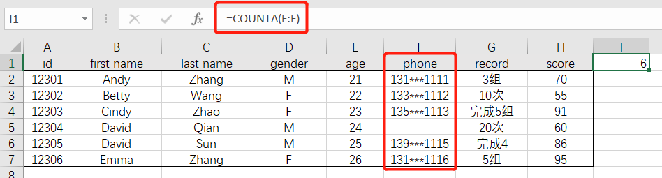

# 03-数值操作

 

## 计数操作

- 计算**数值型**数据的个数：`=COUNT(数据区域)`

 

- 计算**非空数值**的个数：`=COUNTA(数据区域)`

 

- 计算**空值**的个数：`=COUNTBLANK(数据区域)`

COUNTIF

COUNTIFS

 

------

## 求和操作

SUM

SUMIF

SUMIFS

SUMPRODUCT

计算区域内不同单元格个数=SUMPRODUCT(1/COUNTIF(G2:M2,G2:M2))

 

------

## 统计值计算

MIN

MINIFS

MAX

MSAXIFS

AVERAGE

AVERAGEIF

MEDIAN

RANK

FREQUENCY

按组计算中位数（https://www.extendoffice.com/zh-CN/documents/excel/4815-excel-pivot-table-median.html）=MEDIAN(IF($B$2:$B$31=B2,$C$2:$C$31))

