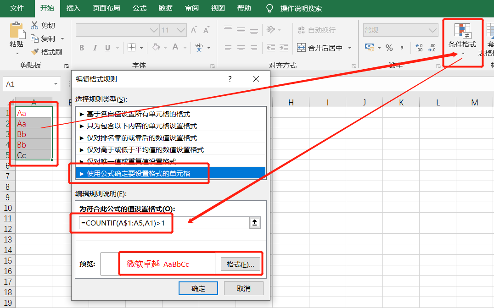
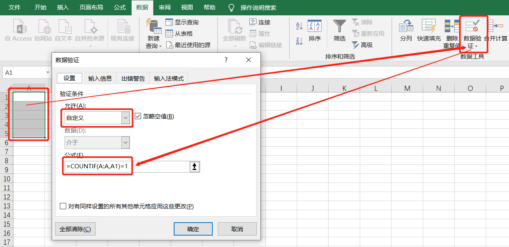

# 05-重复值处理

- [重复值判断](#重复值判断)  COUNTIF()、SUMPRODUCT()
- [日期数据转为文本信息](#日期数据转为文本信息)  TEXT()、DATESTRING()
- [文本转为时间日期格式](#文本转为时间日期格式)  DATEVALUE()、TIMEVALUE()
- [日期数据计算](#日期数据计算)  DATEDIF()、DAYS()、EDATE()

 

## 重复值判断

| 行   | A列      | 功能                    | 公式                                   | 效果 |
| ---- | -------- | ----------------------- | -------------------------------------- | ---- |
| 1    | **`Aa`** | 计算A1重复次数          | `=COUNTIF(A:A,A1)`                     | 2    |
| 2    | **`Aa`** | 判断A1是否重复          | `=IF(COUNTIF(A:A,A1&"*")>1,"重复","")` | 重复 |
| 3    | **`Bb`** | 判断A1是否首次出现      | `=IF(COUNTIF(A$1:A1,A1)=1,"是","否")`  | 是   |
| 4    | **`Bb`** | 判断A1是否首次出现      | `=IF(COUNTIF(A$1:A2,A2)=1,"是","否")`  | 否   |
| 5    | **`Cc`** | 判断A1是否最后一次出现  | `=IF(COUNTIF(A1:A$5,A1)=1,"是","否")`  | 否   |
|      |          | 判断A1是否最后一次出现  | `=IF(COUNTIF(A2:A$5,A2)=1,"是","否")`  | 是   |
|      |          | 判断A1:A5中唯一值的个数 | `=SUMPRODUCT(1/COUNTIF(A1:A5,A1:A5))`  | 3    |

 

### 重复值判断的其他应用

- **突出显示重复出现的数据**

  1. 选中A1:A5单元格区域，【开始 】→ 【条件格式】 → 【**新建规则**】

  2. 选择规则类型：**`使用公式确定要设置格式的单元格`**，写入公式为 `=COUNTIF(A$1:A5,A1)>1`

  3. 点击格式，设置突出显示的格式后确定

 

- **不准录入重复数据**
  1. 选中要输入数据的A1:A5单元格区域，【数据】→【数据验证】→【**数据验证**】
  2. 允许类型选择“**`自定义`**”，公式为：`=COUNTIF(A:A,A2)=1`

 

## COUNTIF函数经典用法合集

https://mp.weixin.qq.com/s/oENvtSZuQiGEF3w0eqRDHA

## 提取不重复值

UNIQUE()

FILTER()

## 这几个超牛函数，你的Excel里有没有？

https://mp.weixin.qq.com/s/f0QHJe9xtMrHbN2X14u3oA

