# 数据匹配与查找

VLOOKUP()、LOOKUP()

INDEX()、MATCH()

分段匹配=LOOKUP(A1, {0,50,60,70,80,90}, {"F","E","D","C","B","A"})

**VLOOKUP函数五个特点**

1、VLOOKUP函数查找值支持使用通配符（"?"号和"*"号）进行查询，但查找值不能使用数组作为参数来生成内存数组。

2、第4个参数决定了是精确还是近似查找方式。

如果为0（或FASLE），用精确匹配方式进行查找，而且支持无序查找；如果为1（或TRUE），则使用近似匹配方式进行查找，要求第2个参数的首列或首行按升序排列。

3、第3个参数中的列号，不能理解为工作表中实际的列号，而是指定返回值在查找范围中的第几列。

4、如果查找值与数据区域关键字的数据类型不一致，会返回错误值#N/A。

5、如果有多条满足条件的记录时，只能返回第一个满足条件的记录。

## 数据匹配

- 匹配**单列**数据：`=VLOOKUP(匹配的列,用于查找的数据表,返回数据表中的第几列,匹配的方式)`

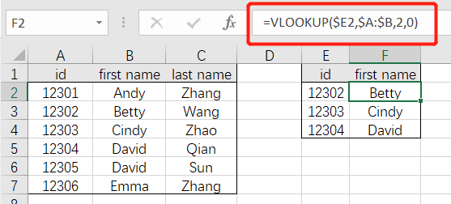

 

- 匹配**多列**数据（支持横向拖拽）：`=VLOOKUP(匹配的列,用于查找的数据表,COLUMN(列信息),匹配的方式)`

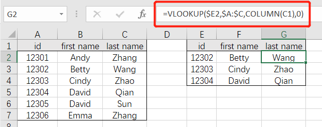

 

- 模糊匹配：`=VLOOKUP("*"&需匹配的关键词&"*",用于查找的数据表,返回数据表中的第几列,匹配的方式)`

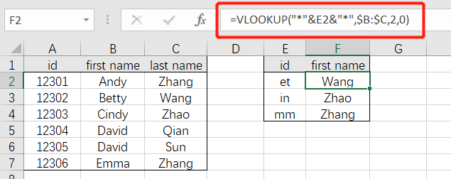

 

- 对未匹配的数值，返回空值：`=IFERROR(VLOOKUP(匹配的列,用于查找的数据表,返回数据表中的第几列,匹配的方式),"")`

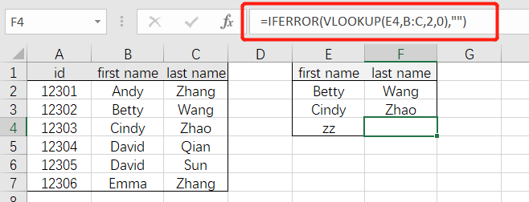

 

- 返回列中的最后一个文本：`=LOOKUP("做",匹配的列)`

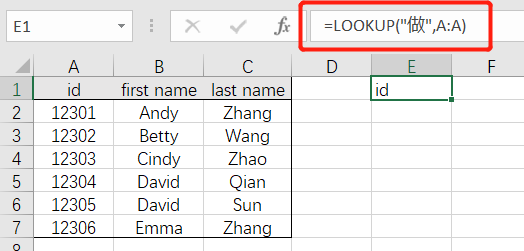

 

- 返回列中的最后一个数值：`=LOOKUP("做",匹配的列)`

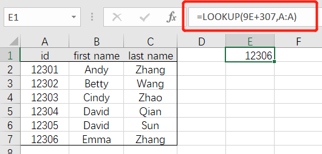

 

- 填充合并单元格：`=LOOKUP("做",B$2:B2)`

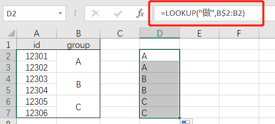

 

- 返回列中的最后一个非空单元格：`=LOOKUP(1,0/(B:B<>""),B:B)`

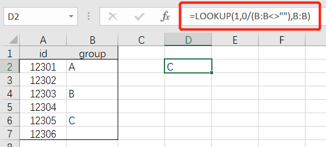

 

- 逆向查询（重复值返回最后一个匹配结果）：`=LOOKUP(1,0/(条件区域=条件),查询区域)`

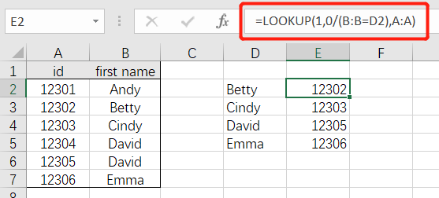

 

- 逆向查询（多条件）：`=LOOKUP(1,0/((条件区域1=条件1)*(条件区域2=条件2)),查询区域)`

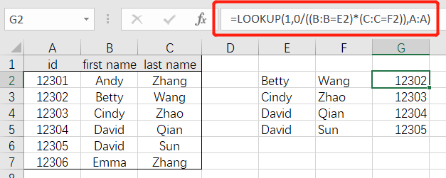

 

- 根据对照表模糊匹配等级（对照表需要升序排列）：`=LOOKUP(匹配数值,对照表区域)`

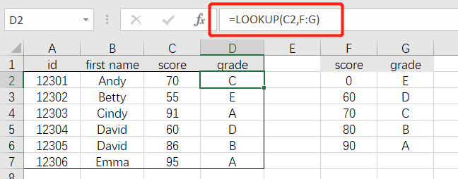

## LOOKUP函数怎么用？今天咱们一起学  Excel之家ExcelHome

https://mp.weixin.qq.com/s?__biz=MjM5NTcxODg0MA==&mid=2689810059&idx=2&sn=53672f9cda7025d9d71d854a50e8c3d8&chksm=8353ad5cb424244a031b46a03ddd3b6378d5a542d3c191af790c4930563b59b36e7d633e045e&mpshare=1&srcid=&sharer_sharetime=1587773569505&sharer_shareid=f44dfb8d1ce5101576067f9cd135d493&from=singlemessage&scene=1&subscene=10000&clicktime=1587779602&enterid=1587779602&ascene=1&devicetype=android-27&version=27000d39&nettype=WIFI&abtest_cookie=AAACAA%3D%3D&lang=zh_CN&exportkey=Aav0f1wXFg2xU9XyLsbfheI%3D&pass_ticket=tjBq1Fc%2BRjJplU%2BGswpQovR2Kc9qvdzF3U5%2F0la6T1TPlCV4WnsGrasjeclHP0cf&wx_header=1

## 查询引用黄金搭档Index+Match应用技巧

https://mp.weixin.qq.com/s?__biz=MzI0MjgyMTEyMQ==&mid=2247490946&idx=1&sn=0537959570e2ab431abe8af9f9c7b8c8&chksm=e9772cecde00a5fa50e57d566e6b71006885c9b8e42558d2757fb195215883c517e0e0caab76&mpshare=1&srcid=&sharer_sharetime=1587906706728&sharer_shareid=f44dfb8d1ce5101576067f9cd135d493&from=singlemessage&scene=1&subscene=10000&clicktime=1587962318&enterid=1587962318&ascene=1&devicetype=android-27&version=27000d39&nettype=WIFI&abtest_cookie=AAACAA%3D%3D&lang=zh_CN&exportkey=AdJo1%2F5DjplwyA%2FViBG8qKo%3D&pass_ticket=LCaoieieKojUNwacniCjI3S6dxHifbZN1yKMaxXwYUfGDiZpC3I%2FxDWQn6erdsiM&wx_header=1

## 学会几个常用函数公式，效率提高4.7%  Excel之家ExcelHome

https://mp.weixin.qq.com/s?__biz=MjM5NTcxODg0MA==&mid=2689810027&idx=1&sn=aedfa3d85bec125d3a1dc0700cd1574b&chksm=8353adbcb42424aae37fce4aa640ae17cfbdbc086b28a95916624570ea6203a2303666093013&mpshare=1&srcid=&sharer_sharetime=1587642171264&sharer_shareid=f44dfb8d1ce5101576067f9cd135d493&from=singlemessage&scene=1&subscene=10000&clicktime=1587779614&enterid=1587779614&ascene=1&devicetype=android-27&version=27000d39&nettype=WIFI&abtest_cookie=AAACAA%3D%3D&lang=zh_CN&exportkey=Acoh98LKA87hP9sY%2FPlYu9Y%3D&pass_ticket=tjBq1Fc%2BRjJplU%2BGswpQovR2Kc9qvdzF3U5%2F0la6T1TPlCV4WnsGrasjeclHP0cf&wx_header=1