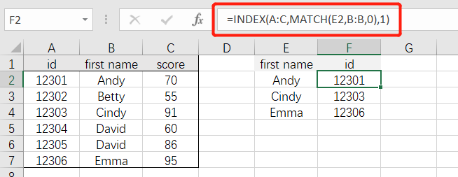
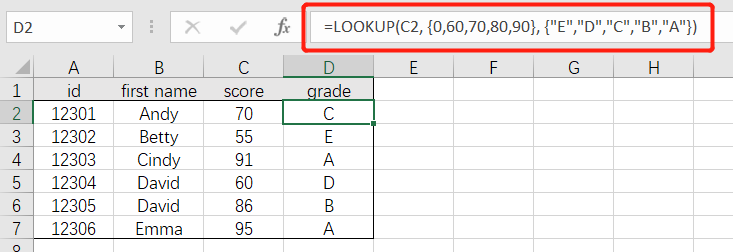

# 数据匹配与查找

INDEX()、MATCH()

**VLOOKUP函数五个特点**

1、VLOOKUP函数查找值支持使用通配符（"?"号和"*"号）进行查询，但查找值不能使用数组作为参数来生成内存数组。

2、第4个参数决定了是精确还是近似查找方式。

如果为0（或FASLE），用精确匹配方式进行查找，而且支持无序查找；如果为1（或TRUE），则使用近似匹配方式进行查找，要求第2个参数的首列或首行按升序排列。

3、第3个参数中的列号，不能理解为工作表中实际的列号，而是指定返回值在查找范围中的第几列。

4、如果查找值与数据区域关键字的数据类型不一致，会返回错误值#N/A。

5、如果有多条满足条件的记录时，只能返回第一个满足条件的记录。

## 数据匹配

- 匹配**单列**数据：`=VLOOKUP(匹配的列,用于查找的数据表,返回数据表中的第几列,匹配的方式)`

 

- 匹配**多列**数据（支持横向拖拽）：`=VLOOKUP(匹配的列,用于查找的数据表,COLUMN(列信息),匹配的方式)`

 

- 模糊匹配：`=VLOOKUP("*"&需匹配的关键词&"*",用于查找的数据表,返回数据表中的第几列,匹配的方式)`

 

- 对未匹配的数值，返回空值：`=IFERROR(VLOOKUP(匹配的列,用于查找的数据表,返回数据表中的第几列,匹配的方式),"")`

 

- 返回列中的最后一个文本：`=LOOKUP("做",匹配的列)`

 

- 返回列中的最后一个数值：`=LOOKUP("做",匹配的列)`

 

- 填充合并单元格：`=LOOKUP("做",B$2:B2)`

 

- 返回列中的最后一个非空单元格：`=LOOKUP(1,0/(B:B<>""),B:B)`

 

- 逆向查询（重复值返回最后一个匹配结果）：`=LOOKUP(1,0/(条件区域=条件),查询区域)`

 

- 逆向查询（多条件）：`=LOOKUP(1,0/((条件区域1=条件1)*(条件区域2=条件2)),查询区域)`

 

- 逆向查询（INDEX + MATCH）：`=INDEX(要返回内容的区域,MATCH(查询值,查询区域,0))`
  - MATCH 返回查询值在查询区域中所在的位置;
  - INDEX 根据位置信息返回数据区域中对应位置的内容。

 

- 根据对照表模糊匹配等级（对照表需要升序排列）：`=LOOKUP(匹配数值,对照表区域)`

 

- 根据对照表模糊匹配等级（无需对照表）：`=LOOKUP(C2, {0,60,70,80,90}, {"E","D","C","B","A"})`

