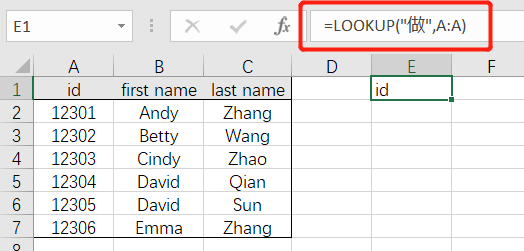
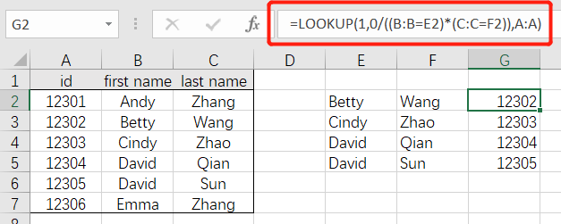
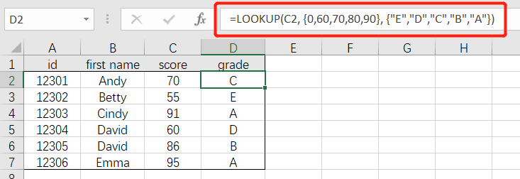

# 06-数据查询

- [常用查询](#常用查询)  VLOOKUP()、COLUMN()、IFERROR()
- [非常规查询](#非常规查询)  LOOKUP()
- [逆向查询](#逆向查询)  LOOKUP()、INDEX()、MATCH()
- [模糊查询](#模糊查询)  VLOOKUP()、LOOKUP()

 

## 常用查询

- 匹配**单列**数据：`=VLOOKUP(匹配的列,用于查找的数据表,返回数据表中的第几列,匹配的方式)`

 

- 匹配**多列**数据（支持横向拖拽）：`=VLOOKUP(匹配的列,用于查找的数据表,COLUMN(列信息),匹配的方式)`

 

- 对未匹配的数值，返回空值：`=IFERROR(VLOOKUP(匹配的列,用于查找的数据表,返回数据表中的第几列,匹配的方式),"")`

 

------

## 非常规查询

- 返回列中的最后一个文本：`=LOOKUP("做",匹配的列)`

 

- 填充合并单元格：`=LOOKUP("做",B$2:B2)`

 

- 返回列中的最后一个数值：`=LOOKUP(9E+307,匹配的列)`

 

- 返回列中的最后一个非空单元格：`=LOOKUP(1,0/(B:B<>""),B:B)`

 

------

## 逆向查询

- 逆向查询（重复值返回最后一个匹配结果）：`=LOOKUP(1,0/(条件区域=条件),查询区域)`

 

- 逆向查询（多条件）：`=LOOKUP(1,0/((条件区域1=条件1)*(条件区域2=条件2)),查询区域)`

 

- 逆向查询（INDEX + MATCH）：`=INDEX(要返回内容的区域,MATCH(查询值,查询区域,0))`
  - MATCH 返回查询值在查询区域中所在的位置;
  - INDEX 根据位置信息返回数据区域中对应位置的内容。

 

------

## 模糊查询

- 模糊匹配：`=VLOOKUP("*"&需匹配的关键词&"*",用于查找的数据表,返回数据表中的第几列,匹配的方式)`

 

- 根据对照表模糊匹配等级（对照表需要升序排列）：`=LOOKUP(匹配数值,对照表区域)`

 

- 无需对照表模糊匹配等级（左闭右开）：`=LOOKUP(C2, {0,60,70,80,90}, {"E","D","C","B","A"})`

 

| [**< <目录**](./README.md) | [**07-数据透视>**](./07-数据透视.md) | [**返回顶部 ↑**](#06-数据查询) |