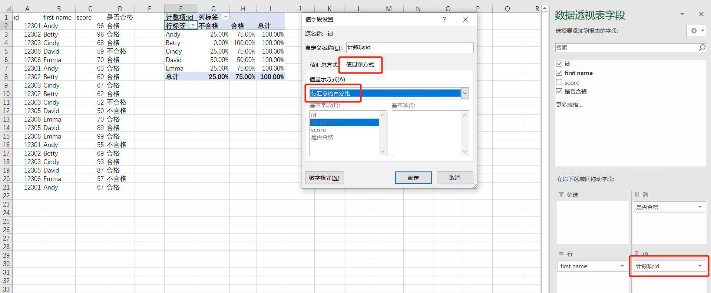
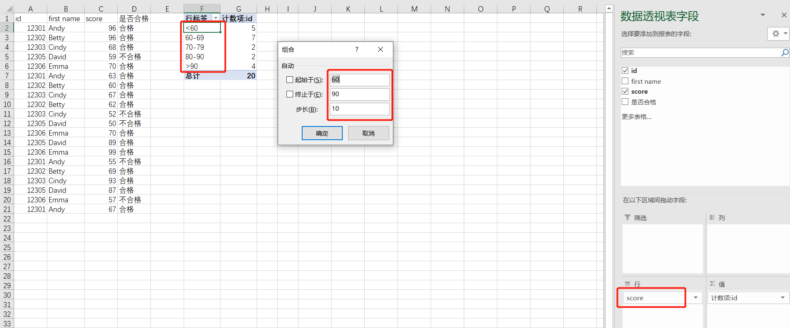

# 07-数据透视

- [行列百分比汇总](#行列百分比汇总)
- [数值分段汇总](#数值分段汇总)

 

## 行列百分比汇总

1. 单击数据透视表字段“值”中的字段，选择【**值字段设置**】；
2. 在弹窗中，【**值汇总方式**】选择适合的**计算类型**，常用的有“计数”或“求和”；
3. 【**值显示方式**】中，选择适合的**值显示方式**，如“行汇总的百分比”、“列汇总的百分比”。

 

 

------

## 数值分段汇总

1. 数据透视表字段中，“**行**”字段必须为**数值型字段**；
2. 右击数据透视表行标签中的任意一行，选择【**组合**】；
3. 在“组合”弹窗中，根据需求设定起始值、终止值和步长。

 

| [**< <目录**](./README.md) | [**返回顶部 ↑**](#07-数据透视) |